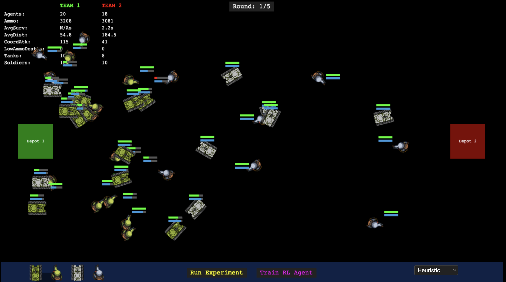

# Designing Intelligent Agents: Comparing Learning Strategies and Command Structures in a Simulated Battlefield

Note: The source code and full report are not publicly available to prevent academic infringement, as this was an academic coursework. If you have any queries about the implementation, please get in touch. You can try the code at [https://baselakasha.github.io/dia-cw/](https://baselakasha.github.io/dia-cw/)

This project explores the design and comparison of multi-agent strategies in a custom-built 2D battlefield simulation. I implemented heuristic-based, commander-coordinated, and reinforcement learning (DQN) agents, then analyzed how these approaches affect team coordination, resource management, and overall performance.

The environment was implemented as a web-based 2D simulation using Phaser.js. Phaser is a simple JavaScript game framework. Its perfect for this project as the simulation is 2D and does not have complex animations or graphics. The focus is on the behaviour and the comparison.

The code was written in object-oriented Programming (OOP) to ensure code reusability and better organisation.

Behaviours are agnostic to agents. Agents behaviours can be changed during runtime which allows to set experiments and answer the proposed questions.

## Results Summary

### Commander vs Decentralized Agents

- Commander-led teams won 99% of rounds against teams with agents acting independently (heuristic without commander).
- Commanded teams achieved a significantly higher number of coordinated attacks, leading to faster and more effective elimination of opponents.
- The statistical analysis (Wilcoxon signed-rank test) confirmed the difference was highly significant (p < 10⁻⁶).
- **Key insight**: Centralized coordination greatly improves team performance in environments where partial information and strategic positioning matter.

### Reinforcement Learning vs Heuristic

- Reinforcement learning agents (trained with DQN) won 61% of rounds against purely heuristic agents.
- RL agents demonstrated emergent strategies, such as retreating when enemies approached their ammo depot, behaviors not explicitly programmed in the heuristics.
- RL agents explored more of the map (greater travel distances) but did not significantly improve coordination metrics compared to heuristic agents, indicating a lack of learned team-level strategies.
- **Key insight**: RL agents adaptively improved individual survival and efficiency but coordination was limited without explicit multi-agent training.

### Overall Findings

- Centralized control via a Commander was by far the most effective approach, overwhelming uncoordinated heuristics.
- Reinforcement learning enabled agents to discover new, environment-specific tactics beyond hand-coded rules but fell short of achieving team-level coordination.
- Experiments confirmed both the strengths of central planning and adaptability of learning-based agents, while highlighting areas where multi-agent cooperation could further improve outcomes.
